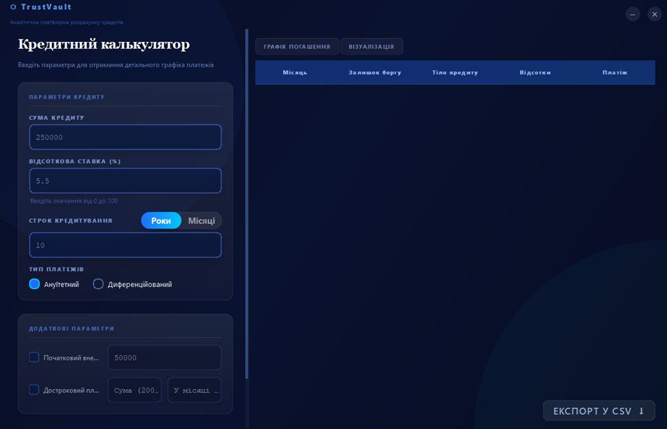
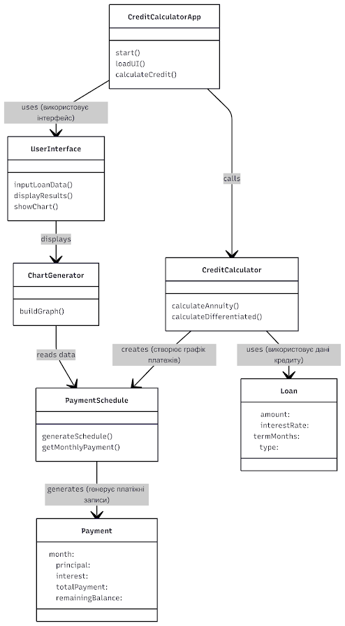

# TrustVault: Loan Calculator (Кредитний калькулятор)

> 

Десктопний застосунок для розрахунку графіка погашення кредиту, реалізований мовою **Python** з використанням **PyQt5** та **Matplotlib**. Підтримуються ануїтетна та диференційована схеми погашення, дострокове погашення, комісія, початковий внесок, побудова графіка та експорт результатів у CSV. Бізнес-логіка повністю відокремлена від графічного інтерфейсу та покрита модульними тестами.


# Архітектура: MVC 

## Схема архітектури

> 

---

## Логічна структура компонентів

```text
Архітектура побудована на принципі розділення відповідальності між шарами.
main.py  -  CreditCalculatorApp
│  Ініціалізує QApplication
│  Створює Controller + View
│  Запускає цикл подій
│
├── controller.py      - LoanController
│    ├── validator.py  - InputValidator
│    ├── strategies.py - LoanStrategy (ABC)
│    │       ├── AnnuityStrategy
│    │       └── DifferentiatedStrategy
│    ├── model.py      - Loan, Payment, PaymentSchedule
│    └── chart_generator.py - ChartGenerator
│
└── view.py - UserInterface (тільки UI, без розрахунків)
```

---

# Розподіл відповідальності

| Шар             | Файл                 | Призначення                                             |
| --------------- | -------------------- | ------------------------------------------------------- |
| **Model**       | `model.py`           | Доменні сутності (`Loan`, `Payment`, `PaymentSchedule`) |
| **Strategy**    | `strategies.py`      | Алгоритми розрахунку погашення                          |
| **Validator**   | `validator.py`       | Перевірка та обробка введених даних                     |
| **Controller**  | `controller.py`      | Координація компонентів                                 |
| **Chart**       | `chart_generator.py` | Побудова графіка (Matplotlib) з кешуванням              |
| **View**        | `view.py`            | Графічний інтерфейс                                     |
| **Entry point** | `main.py`            | Запуск застосунку                                       |

---

# Використані патерни проєктування

* **MVC**
* **Strategy**
* **Observer (callback-механізм)**
* **Cache**
* **Dataclass**

---

# Функціональні можливості

* Розрахунок ануїтетного платежу
* Розрахунок диференційованого платежу
* Обробка 0% ставки
* Дострокове погашення з перерахунком графіка
* Підтримка початкового внеску
* Формування графіка платежів
* Побудова графіка залишку боргу
* Експорт у CSV
* Перевірка граничних випадків

---

# Тестування

Реалізовано понад **80 модульних тестів**.

Покриття бізнес-логіки: **~97%**.

Інтерфейс `view.py` не покривається модульними тестами.

Запуск тестування:

```bash
pytest -v
```

З покриттям:

```bash
pytest -v --cov= --cov-report=term-missing
```

# Встановлення та запуск (Python 3.10+)

```bash
pip install -r requirements.txt
python main.pyw
```